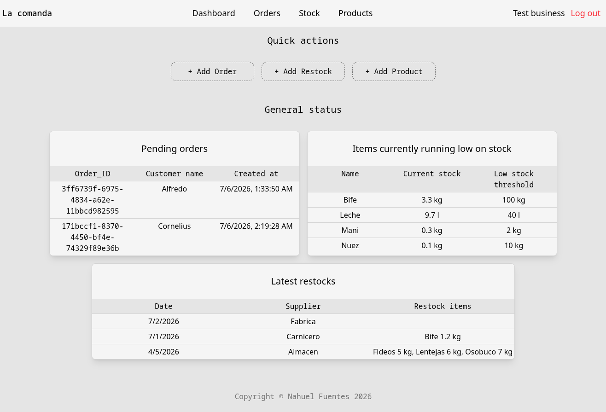

<p align="center">
  
  <br/>
  <strong>La comanda</strong>
</p>

<p align="center">
  
  
  
  
  
</p>Backend API for small food businesses to manage stock, orders, customers and restocking. Built for the typical Argentine take-out workflow where orders come in via WhatsApp and the cook tracks everything manually.

## Demo

[**Live demo**](https://la-comanda-manager.vercel.app/)



## Stack
FastAPI · SQLAlchemy (async) · PostgreSQL on Supabase · Alembic · Pydantic · React · Tailwind CSS · Typescript

## Roadmap
- [x] Business, Product, Item, Customer, Restock, Recipe endpoints
- [x] Stock logic on restock and order creation
- [x] Order endpoints 
- [ ] React + TypeScript frontend
  + [x] Login Screen
  + [x] Orders Screen
  + [x] Stock Screen
  + [x] Dashboard Screen
  + [ ] Home Screen
  + [x] Products Screen
  + [ ] Dark theme
  + [x] Error handling
+ [ ] Modify endpoint:
  + [x] Allow pagination and more queries on each orders and restock endpoints
  + [x] Add product endpoint with full details using join (PriceHistory and RecipeItems)
+ [ ] Playwright testing E2E each page
- [x] Deploy to Railway + Vercel

## Testing
96% code coverage across 8 test files. Each test runs against an in-memory SQLite database with automatic rollback — no real database needed. Auth is mocked via FastAPI dependency overrides. CI runs on every push via GitHub Actions.

Exploratory and manual testing done via Postman.

Run tests:
\```bash
cd backend
pytest tests/ -v --cov
\```
